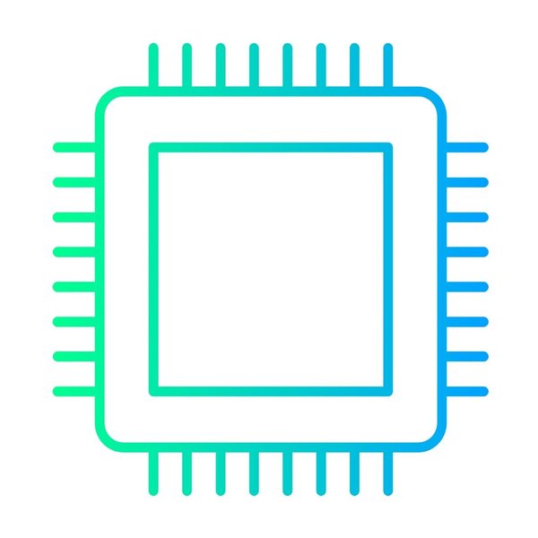

#   Component Hub 

**Component Hub** is an intuitive inventory management app tailored for private makers and engineers. This innovative solution leverages the power of NFC tags, allowing you to seamlessly access your component inventory, costs, specifications, and datasheets directly from your phone. No need for additional devices like labelers for QR codes or barcode scanners. With Component Hub, managing your components becomes faster, easier, and more efficient, all within the convenience of your mobile device.

- Starting a new project? Create it in the app, add components, and instantly see what's missing. 
- Trying to find a specific component? Check its location in the app with ease. 
- Ever thought, "Wasn't that cheaper the last time I bought it?" With Component Hub, you can check pricing information in the app and see what you paid previously. 
  
Simplify your inventory management and focus more on creating with Component Hub.

## Installation
1. Install the backend following the instructions [here](./backend/README.md).
2. Setup the frontends you need following the instructions [here](./frontend/README.md).

