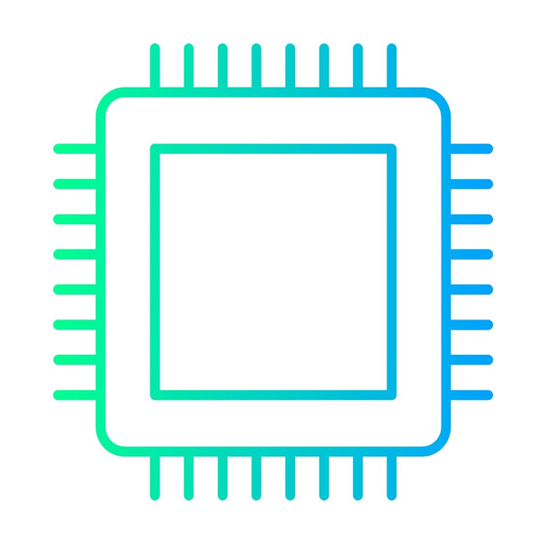

#   Component Hub 

**Component Hub** is an intuitive inventory management app tailored for private makers and engineers. This innovative solution leverages the power of NFC tags, allowing you to seamlessly access your component inventory, costs, specifications, and datasheets directly from your phone. No need for additional devices like labelers for QR codes or barcode scanners. With Component Hub, managing your components becomes faster, easier, and more efficient, all within the convenience of your mobile device.

- Starting a new project? Create it in the app, add components, and instantly see what's missing. 
- Trying to find a specific component? Check its location in the app with ease. 
- Ever thought, "Wasn't that cheaper the last time I bought it?" With Component Hub, you can check pricing information in the app and see what you paid previously. 
  
Simplify your inventory management and focus more on creating with Component Hub.

## Getting Started
ToDo

## Installation
> Note: Make sure to follow the backend setup instructions first!

### Android
1. Download the app from the release folder and install it on your phone.
2. Open the app and go to the "Settings" page. Enter the url of your backend server at "Server URL" and click the save button. A popup will tell you whether the app was able to establish a connection. If you can't establish a connection, follow the troubleshooting guide.
3. You can now use the app normally. Check out [Getting Started](#Getting-Started) for further informations.

### Web
1. Download the "web" folder.
2. Put the folder on your server and add the according proxy informations if needed.
3. Check [Deploy to web](https://docs.flutter.dev/deployment/web#deploying-to-the-web) for more information.

### Docker
1. Navigate with a terminal to the `docker` folder.
2. (optional) If you want to update some settings, make sure to check the `docker-compose.yml` file and update the according [variables](#variables). 
3. Run `docker compose up -d` to start the build process and deploy in detached mode.

#### Variables

| Variable | Type | Description |
| --- | --- | --- |
| Ports | - | Default port is set to `80` |
| SERVER_URL | Environment-Variable | Default is set to null. If you change the url, make sure to add the full path e.g. `https://my.domain.com`. Do not add a port.  |

## Roadmap

- [x] main pages
- [x] nfc logic
- [x] add drawer navigation 
- [ ] Hub Page
  - [x] Datatable sort 
  - [x] search
  - [ ] Filters
- [ ] Project (edit) Page
- [ ] Location (edit) Page
- [x] Persist backend url
- [x] Add url_launcher for read-tag to component page
- [ ] component Page
  - [ ] add desktop view
  - [ ] Make categories clickable(x)/ editable
  - [ ] Make Location clickable/ editable
  - [x] update description
  - [x] update/add/remove specs
  - [x] update/add/remove resources
  - [x] update/add/remove vendor info
  - [ ] edit full component
- [ ] api integration
- [ ] add impressum, datenschutz, about